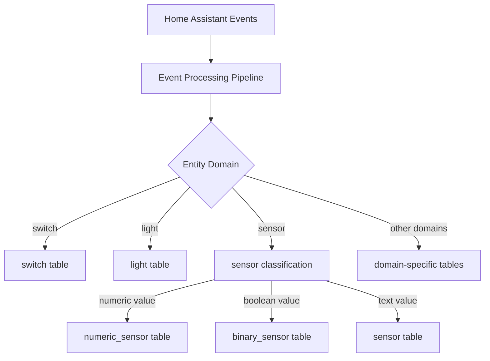
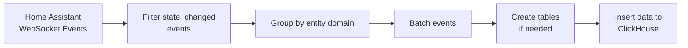
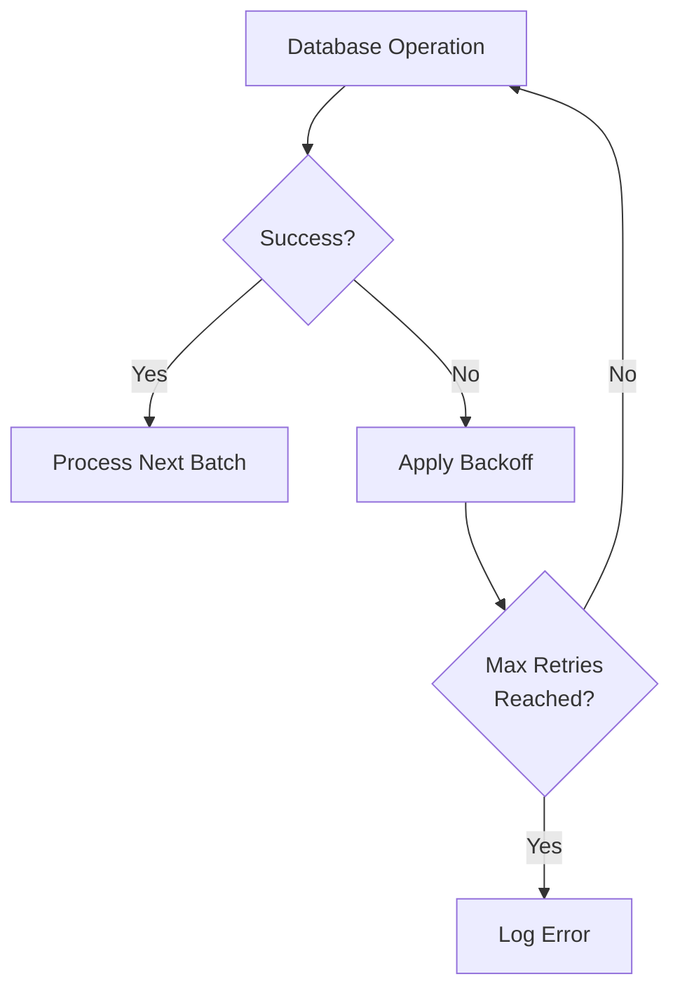

# hass2ch

`hass2ch` is a data ingestion pipeline that connects Home Assistant events to ClickHouse,
allowing you to store and analyze your smart home data at scale.

Not focused on performance, but on simplicity and ease of use.
It provides a decent delivery guarantee using retries.
No deduplication is implemented, so it's up to the user to ensure that the data is not duplicated.

## Getting Started

### Prerequisites

- Home Assistant instance with API token and websockets enabled
- ClickHouse database
- (Optional) Prometheus and Grafana for monitoring

### Installation

#### Docker

```bash
docker run -d \
  --name hass2ch \
  -e HASS_TOKEN=your_hass_token \
  ghcr.io/jkaflik/hass2ch:latest \
  pipeline \
  --host homeassistant.local \
  --clickhouse-url http://clickhouse:8123
```

#### Kubernetes with Helm

```bash
# Add the repository (if hosted)
helm repo add hass2ch https://jkaflik.github.io/hass2ch/charts
helm repo update

# Install the chart
helm install hass2ch hass2ch/hass2ch \
  --set homeAssistant.token=your_hass_token \
  --set clickhouse.url=http://clickhouse:8123
```

Or install directly from the repository:

```bash
git clone https://github.com/jkaflik/hass2ch.git
cd hass2ch
helm install hass2ch ./charts/hass2ch \
  --set homeAssistant.token=your_hass_token \
  --set clickhouse.url=http://clickhouse:8123
```

### Basic Usage

```bash
# Set your Home Assistant token
export HASS_TOKEN=your_hass_token

# Run the ingestion pipeline
hass2ch pipeline \
  --host homeassistant.local \
  --clickhouse-url http://clickhouse:8123 \
  --clickhouse-database hass
```

### Configuration Options

```
Usage: hass2ch [command]

Commands:
  help     Show this help message
  dump     Dump events to stdout
  pipeline Run the ingestion pipeline (Home Assistant to ClickHouse)

Flags:
  --log-level string                Log level (default "info")
  --host string                     Home Assistant host (default "homeassistant.local")
  --secure                          Use secure connection to Home Assistant
  --clickhouse-url string           ClickHouse HTTP URL (default "http://localhost:8123")
  --clickhouse-database string      ClickHouse database (default "hass")
  --clickhouse-username string      ClickHouse username (default "default")
  --clickhouse-password string      ClickHouse password
  --clickhouse-max-retries int      Maximum number of retries for ClickHouse operations (default 5)
  --clickhouse-initial-interval     Initial retry interval for ClickHouse operations (default 500ms)
  --clickhouse-max-interval         Maximum retry interval for ClickHouse operations (default 30s)
  --clickhouse-timeout              Timeout for ClickHouse operations (default 60s)
  --metrics-addr string             Address to expose Prometheus metrics on (default ":9090")
  --enable-metrics                  Enable Prometheus metrics server (default true)
```

## Observability

The service exposes Prometheus metrics on port 9090 by default:

```bash
curl http://localhost:9090/metrics
```

Key metrics include:
- Events received, filtered, and processed
- Batch sizes and processing times
- Database operations and latencies
- ClickHouse connection status
- Retry attempt counts and success rates

### Dashboards

The included Grafana dashboards provide visibility into:

1. **Overall system health and throughput**
2. **Database operation performance**
3. **Retry patterns and success rates**

## Data Model and Processing Pipeline

### Data Mapping

Home Assistant state change events are mapped to ClickHouse tables dynamically based on entity domains. Each entity domain gets its own table with type inference based on the entity type.



### ClickHouse Table Schema

Each domain-specific table follows this structure:

```sql
CREATE TABLE IF NOT EXISTS hass.{domain} (
    entity_id LowCardinality(String),
    state {StateType},
    old_state {StateType},
    attributes JSON,
    context JSON,
    last_changed DateTime64(3, 'UTC'),
    last_updated DateTime64(3, 'UTC'),
    last_reported DateTime64(3, 'UTC'),
    received_at DateTime64(3, 'UTC') DEFAULT now64(3)
) ENGINE = MergeTree()
PARTITION BY toYYYYMM(last_updated)
ORDER BY (entity_id, last_updated)
```

The `{StateType}` is automatically determined based on the entity domain:
- Boolean entities (switches, binary sensors): `Bool`
- Numeric sensors: `Float64`
- Number inputs: `Nullable(Float64)`
- Counters: `Int64`
- Date/time entities: `DateTime`
- Other entities: `String` or `LowCardinality(String)` depending on cardinality

### Processing Pipeline



The pipeline performs the following transformations:

1. **Filtering**: Only `state_changed` events are processed
2. **Entity classification**:
   - Sensor entities are further classified as:
     - `numeric_sensor` if the state is a number
     - `binary_sensor` if the state is "on/off" or "true/false"
     - `sensor` for other text values
3. **Data normalization**:
   - Boolean values are converted to true/false
   - Unknown or unavailable states are handled
4. **Table creation**: Tables are dynamically created for new entity domains
5. **Batching**: Events are batched by domain for efficient insertion
6. **Insertion**: Data is inserted into the appropriate tables

### Retry Mechanism

The pipeline includes a robust retry system for resilience against transient failures:



The retry system uses exponential backoff with configurable:
- Maximum retry attempts
- Initial retry interval
- Maximum retry interval
- Randomization factor to prevent thundering herd

## Contributing

Contributions are welcome! Please feel free to submit a Pull Request.

## License

This project is licensed under the MIT License - see the [LICENSE](LICENSE) file for details.
